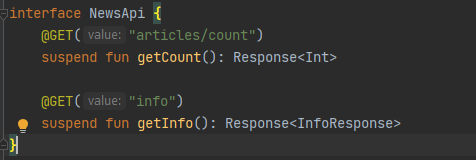
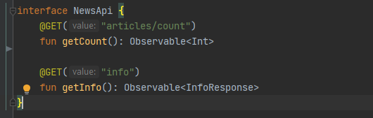

<h1 align="center">RXJAVA X COROUTINES</h1>

  
Exemplo para mapear as apis, com coroutines, observe a imagem a baixo que tem que ter o metodo suspend
na frente da função para fazer a chamada assíncrona

  

  
Exemplo para mapear as apis, com rx, observe a imagem a baixo que tem que ter o returno Observable

  

 
